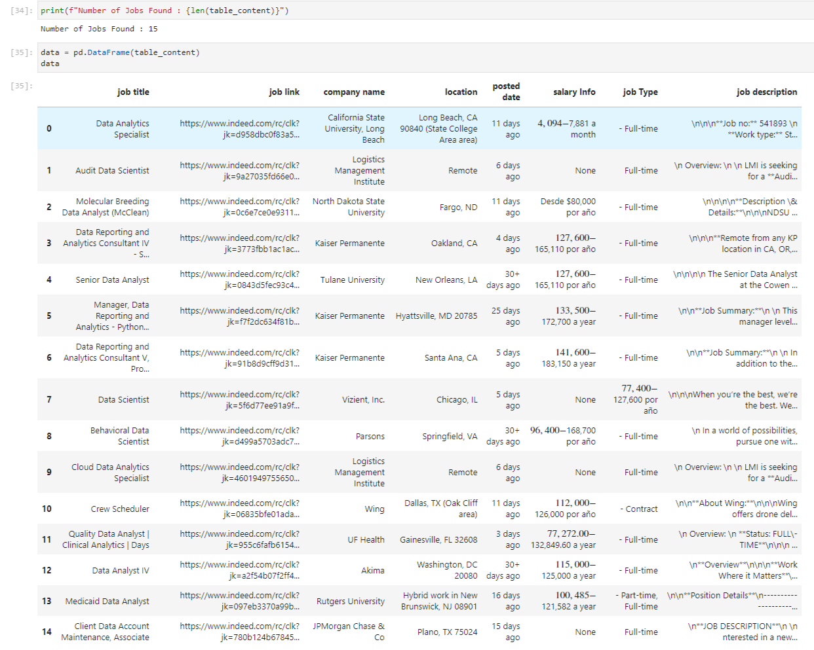

# Web Scraping of Job Vacancies

##### => This project is challenge from [Coursera project](https://www.coursera.org/learn/scrape-job-postings-data-analyst).
I have scrap data from [indeed](indeed.com) with help Scrapfly.

this is an image of data : 

## Introduction

In this project, we'll build a web scraper to extract job listings from a popular job search platform. We'll extract job titles, companies, locations, job descriptions, and other relevant information.

Here are the main steps in this project:

1. get the html content using Scrapfly  API.
2.  Parsing the webpage content  using BeautifulSoup.
3. Extract job data from the content using BeautifulSoup methods.
4. Save the data to a CSV file

## Prerequisites

you need to create Scrapfly account to get API key, and you will use the following packages in your Python environment:

- scrapfly-sdk
- BeautifulSoup
- csv
- markdownify
- pandas

you can install additional packages using `!pip install packagename` :

- `!pip install scrapfly-sdk`
- `!pip install BeautifulSoup`
- `!pip install pandas`
- `!pip install markdownify`

## Note : 
You can search for any job in any country by changing the values of those variables :  `query` and `location`.
